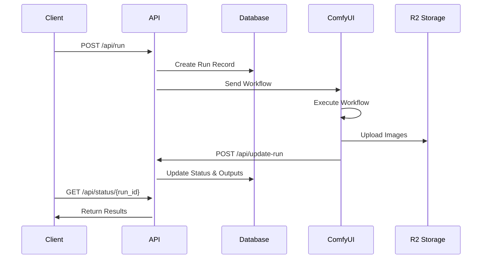
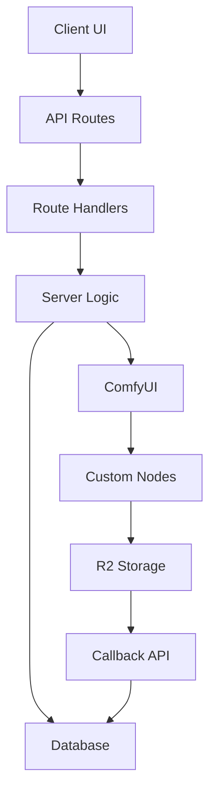
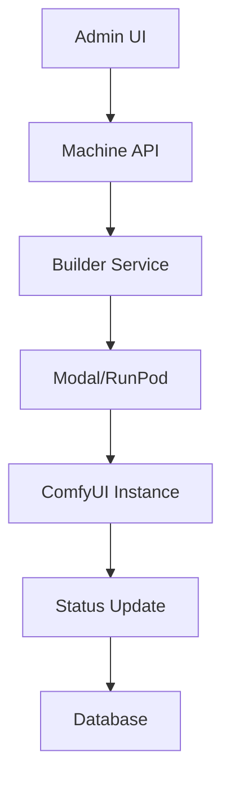

这是 fork 出来的，原项目是https://github.com/BennyKok/comfyui-deploy
会汉化！

localhost 方法不成功！

# ComfyUI Deploy

Open source comfyui deployment platform, a `vercel` for generative workflow infra. (serverless hosted gpu with vertical intergation with comfyui)

> [!NOTE]  
> Im looking for creative hacker to join ComfyDeploy's core team! DM me on [twitter](https://x.com/BennyKokMusic)

Join [Discord](https://discord.gg/EEYcQmdYZw) to chat more or visit [Comfy Deploy](https://comfydeploy.com/) to get started!

Check out our latest [nextjs starter kit](https://github.com/BennyKok/comfyui-deploy-next-example) with Comfy Deploy

\# How it works

1. Comfy Deploy Dashboard (https://comfydeploy.com) or self-hosted version
2. Machines (Long running, on-premise ComfyUI machines and serverless)
3. Supports runpods, modal, and hosted ComfyDeploy machines (powered by modal)

https://github.com/BennyKok/comfyui-deploy/assets/18395202/85f85325-a4bb-446d-aa67-ed225ee03479

# Setting up a basic sd txt2img API

https://github.com/BennyKok/comfyui-deploy/assets/18395202/0fb1829b-401a-41f2-b21a-5b77483c6ee2

# Comfy Deploy Plugin Installation

> Plugin lets you set up the machine as a target machine, and also upload workflow directly from there

1. `cd custom_nodes`
2. `git clone https://github.com/BennyKok/comfyui-deploy.git`
3. Go to (https://comfydeploy.com) or a self-hosted version
   - Machines -&gt; Add Machines
     - Enter a name and the URL of your machines (set up Ngrok for a public URL for your machines)
     - Create a new ComfyDeploy machines (pick any custom nodes).

# Usecase

1. Deploy a complicated comfy workflow with a versioning system
2. Manage versioning and easily preview different generated versions' output
3. Persistent API generated for Production and Staging environment
4. Run the same comfyui workflow across different remote machines

\# Status & Timeline

WIP, welcomes contributors!! Please join Discord -&gt; https://discord.gg/EEYcQmdYZw

Primary goal -&gt; release v0.1.0 of stable Comfy Deploy

Major areas

- Security enforcement
- Error handling
- QOL workflow improvement
- API usage examples
- Load balancing
- Workflow dependencies checking (custom nodes)
- Remote machines
- Serverless machines? Possible to set up a clean environment via Salad, Modal, etc
- LCM realtime web socket image gen

# Tech Stack

- Shadcn UI

- NextJS

- Clerk (Auth)

- Neon / Vercel Postgres (Database)

- Drizzle (ORM)

- R2 / S3 (Object Storage)

# Development

1. `git clone https://github.com/BennyKok/comfyui-deploy`
2. `cd web`
3. `bun i`
4. Start docker
5. `cp .env.example .env.local`
6. Replace `JWT_SECRET` with `openssl rand -hex 32`
7. Get a local clerk dev key for `NEXT_PUBLIC_CLERK_PUBLISHABLE_KEY` and `CLERK_SECRET_KEY`
8. Keep a terminal live for `bun run db-dev`
9. Execute the local migration to create the initial data `bun run migrate-local`
10. Finally start the next server with `bun dev`

**Schema Changes**

1. `bun run generate`
2. `bun run migrate-local`

# Special Thanks

- comfyui
- oss/acc

# Self Hosting with Vercel

[](https://www.youtube.com/watch?v=hWvsEY1cS2M)
Tutorial Created by [Ross](https://github.com/rossman22590) and [Syn](https://github.com/mortlsyn)

Build command

```
next build && bun run migrate-production
```

Install command

```
npx bun@1.0.16 install
```

Env key setup

```
POSTGRES_URL=

NEXT_PUBLIC_CLERK_PUBLISHABLE_KEY=
CLERK_SECRET_KEY=

SPACES_ENDPOINT="http://localhost:4566"
SPACES_ENDPOINT_CDN="http://localhost:4566"
SPACES_BUCKET="comfyui-deploy"
SPACES_KEY="xyz"
SPACES_SECRET="aaa"

# generate using -> openssl rand -hex 32
JWT_SECRET=

# r2 settings
SPACES_REGION="auto"
SPACES_CDN_FORCE_PATH_STYLE="true"
SPACES_CDN_DONT_INCLUDE_BUCKET="true"

# digital ocean settings
SPACES_REGION="nyc3"
SPACES_CDN_FORCE_PATH_STYLE="false"

# s3 settings
SPACES_REGION="nyc3"
SPACES_CDN_DONT_INCLUDE_BUCKET="false"
SPACES_CDN_FORCE_PATH_STYLE="true"
```

# ComfyUI Deploy API Documentation

## Architecture Overview

### Core Components

- **Web Server**: Next.js + Hono (API Routes)
- **Database**: PostgreSQL + Drizzle ORM
- **Storage**: Cloudflare R2
- **ComfyUI Integration**: Custom Python Server

### Directory Structure

```
web/
├── src/
│   ├── app/
│   │   └── (app)/api/         # API Routes
│   ├── routes/                # Hono Route Handlers
│   ├── server/                # Business Logic
│   └── db/                    # Database Schema & Queries
├── test/                      # API Tests
└── comfyui-deploy/           # ComfyUI Integration
```

## API Flow

### Workflow Execution Flow



### Status Lifecycle

```
not-started -> running -> uploading -> success
                      \-> failed
```

## API Endpoints

### Create Run

```typescript
POST /api/run
Content-Type: application/json
Authorization: Bearer <API_TOKEN>

{
  "deployment_id": "string",
  "inputs": {
    "text_input": "string"
  }
}

Response:
{
  "run_id": "uuid"
}
```

### Get Run Status

```typescript
GET /api/status/{run_id}
Authorization: Bearer <API_TOKEN>

Response:
{
  "id": "string",
  "status": "not-started" | "running" | "uploading" | "success" | "failed",
  "started_at": "datetime",
  "ended_at": "datetime",
  "duration": number,
  "outputs": [{
    "images": [{
      "url": "string",
      "type": "output",
      "filename": "string",
      "subfolder": "string",
      "upload_duration": number
    }],
    "created_at": "datetime"
  }],
  "error": "string",
  "progress": {
    "current": number,
    "total": number,
    "message": "string"
  }
}
```

### Update Run Status (Internal)

```typescript
POST /api/update-run
Content-Type: application/json

{
  "run_id": "string",
  "output_data": {
    "images": [{
      "filename": "string",
      "data": "base64"
    }]
  }
}
```

## Implementation Details

### Database Schema

```typescript
// Key Tables
workflowRunsTable {
  id: uuid
  workflow_version_id: uuid
  status: enum
  started_at: timestamp
  ended_at: timestamp
}

workflowRunOutputs {
  id: uuid
  run_id: uuid
  data: jsonb
}
```

### Image Processing Flow

1. ComfyUI generates images
2. Images uploaded to R2 Storage
3. URLs constructed: `${CDN_ENDPOINT}/outputs/runs/${run_id}/${filename}`
4. URLs stored in database with run outputs

### Environment Configuration

```env
SPACES_ENDPOINT="https://xxx.r2.cloudflarestorage.com"
SPACES_ENDPOINT_CDN="https://pub-xxx.r2.dev"
SPACES_BUCKET="comfyui-deploy"
SPACES_KEY="xxx"
SPACES_SECRET="xxx"
```

## Usage Example

```typescript
import axios from "axios";

const API_BASE = "http://localhost:3000/api";
const headers = {
  Authorization: `Bearer ${API_TOKEN}`,
  "Content-Type": "application/json",
};

// Create run
const runResponse = await axios.post(
  `${API_BASE}/run`,
  {
    deployment_id,
    inputs: { text_input: "test generation" },
  },
  { headers }
);

// Poll status
async function pollRunStatus(run_id: string) {
  while (true) {
    const { data } = await axios.get(`${API_BASE}/status/${run_id}`, {
      headers,
    });

    if (data.status === "success") {
      return data;
    }

    if (data.status === "failed") {
      throw new Error(data.error);
    }

    await new Promise((resolve) => setTimeout(resolve, 2000));
  }
}

const result = await pollRunStatus(runResponse.data.run_id);
console.log("Images:", result.images);
```

## Error Handling

- API returns appropriate HTTP status codes
- Failed runs include error details in status response
- Image upload failures still return valid CDN URLs

## Security

- API requires Bearer token authentication
- Tokens can be created and managed via API keys
- Rate limiting applied to public endpoints

## Project Architecture

### Core Structure

```
.
├── web/                       # Web Application
│   ├── src/
│   │   ├── app/              # Next.js App Router
│   │   │   ├── (app)/       # Main Application
│   │   │   │   ├── api/     # API Endpoints
│   │   │   │   ├── workflows/ # Workflow UI
│   │   │   │   └── machines/ # Machine Management
│   │   │   └── (docs)/      # Documentation
│   │   ├── components/       # React Components
│   │   ├── routes/          # API Route Handlers
│   │   ├── server/          # Business Logic
│   │   ├── db/              # Database Layer
│   │   ├── lib/             # Utilities
│   │   └── types/           # TypeScript Types
│   ├── public/              # Static Assets
│   ├── test/                # API Tests
│   └── drizzle/             # Database Migrations
├── comfy-nodes/             # ComfyUI Custom Nodes
├── builder/                 # Build System
└── web-plugin/             # ComfyUI Web Plugin
```

### Component Details

#### 1. Web Application (`web/`)

- **Frontend (`src/components/`)**

  - `ui/`: Base UI components (shadcn/ui)
  - `RunDisplay.tsx`: Execution status
  - `WorkflowList.tsx`: Workflow management
  - `MachineList.tsx`: Machine management
  - `custom-form/`: Custom form components
  - `docs/`: Documentation components

- **API Layer (`src/app/(app)/api/`)**

  - `update-run/`: ComfyUI callback handling
  - `file-upload/`: Image upload processing
  - `machine-built/`: Machine build status
  - `view/`: Image serving

- **Route Handlers (`src/routes/`)**

  - `registerGetStatusRoute.ts`: Status polling
  - `registerCreateRunRoute.ts`: Run creation
  - `registerDeploymentsRoute.ts`: Deployment management
  - `registerUploadRoute.ts`: File uploads

- **Server Logic (`src/server/`)**

  - `createRun.ts`: Workflow execution
  - `curdApiKeys.ts`: API key management
  - `curdMachine.ts`: Machine management
  - `getFileDownloadUrl.ts`: Storage URLs
  - `editWorkflowOnMachine.tsx`: Workflow editing

- **Database (`src/db/`)**
  - `schema.ts`: Data models
  - `db.ts`: Database connection
  - Migration files in `drizzle/`

#### 2. ComfyUI Integration (`comfy-nodes/`)

- Custom node implementations:
  - Input nodes (text, image, number, etc.)
  - Output nodes (image, websocket)
  - Model handling nodes
  - External resource nodes

#### 3. Build System (`builder/`)

- `modal-builder/`: Modal.com serverless builder
  - Dockerfile configuration
  - Build requirements
  - Template system

#### 4. Web Plugin (`web-plugin/`)

- ComfyUI web interface integration

### Data Flow Architecture

1. **Workflow Creation & Execution**



2. **Machine Management**



### Key Features

1. **Workflow Management**

- Version control
- Custom node support
- Real-time status updates
- Input validation

2. **Machine Management**

- Multiple provider support
  - Modal.com
  - RunPod
  - Custom servers
- Auto-scaling
- Health monitoring

3. **Storage System**

- Cloudflare R2 integration
- CDN delivery
- Image processing
- Version management

4. **Security**

- JWT authentication
- API key management
- Role-based access
- Request validation

### Development Tools

- `drizzle/`: SQL migrations
- `test/`: API testing
- `aws/`: Cloud configuration
- Development containers
