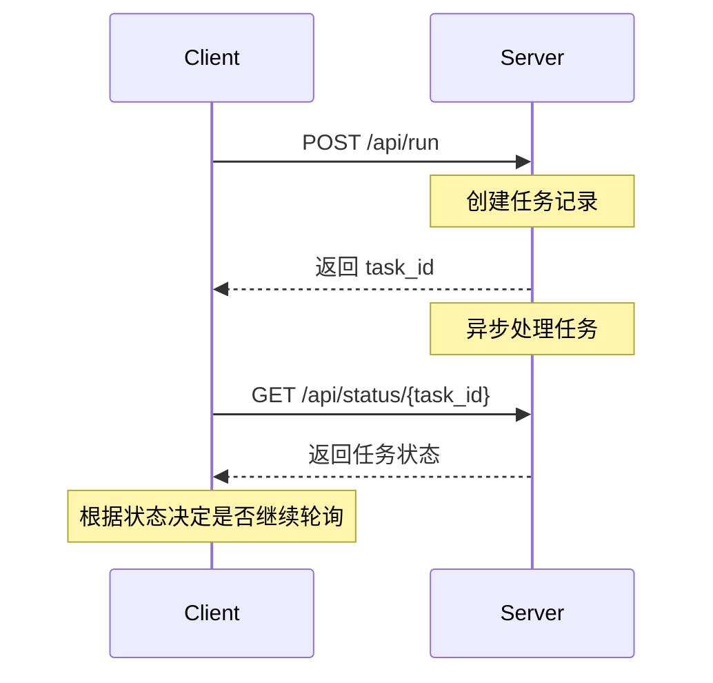
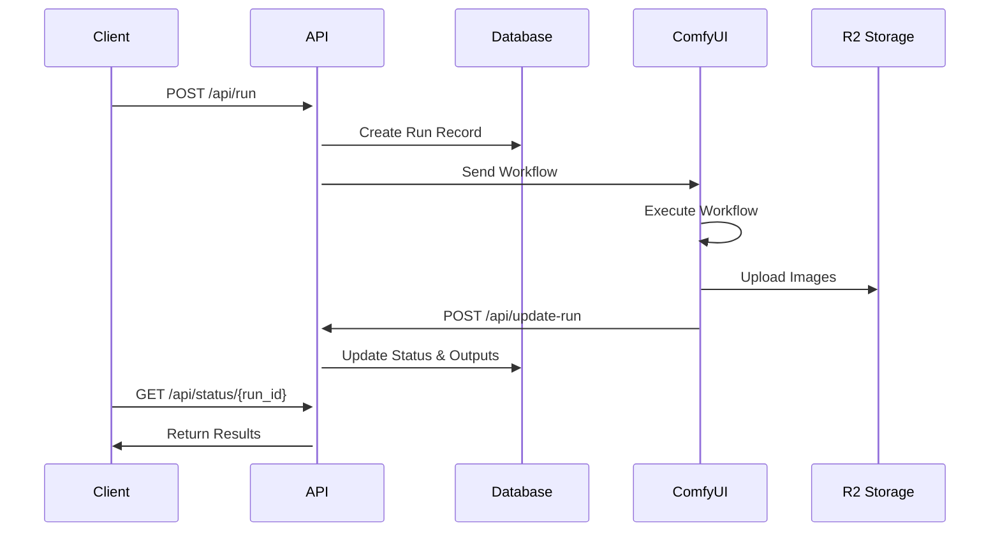
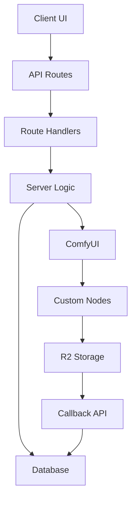
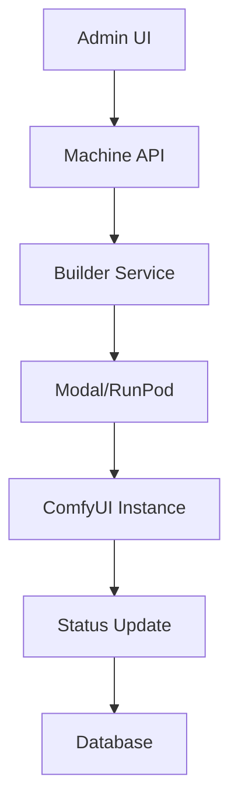

# ComfyUI Deploy

这是 fork 出来的，原项目是https://github.com/BennyKok/comfyui-deploy
会汉化！

# 重要更新记录

## 1. CORS 问题修复

### 问题描述

在使用 Figma 插件时，出现跨域请求被阻止的问题。

### 解决方案

1. 更新 `vercel.json` 配置：

```json
{
  "headers": [
    {
      "source": "/api/(.*)",
      "headers": [
        { "key": "Access-Control-Allow-Origin", "value": "*" },
        { "key": "Access-Control-Allow-Methods", "value": "GET, POST, OPTIONS" }
      ]
    }
  ]
}
```

2. 在 API 路由中添加 CORS 中间件：

```typescript
app.use("*", corsHandler);
```

## 2. Vercel 60s 超时问题

### 问题描述

Vercel 函数有 60 秒的超时限制，导致长时间运行的任务失败。

### 解决方案

实现异步任务处理机制：

1. 立即返回任务 ID
2. 后台异步处理请求
3. 客户端通过轮询获取结果

### API 调用流程



## 3. 图片 URL 格式问题

### 问题描述

在使用过程中，发现前端和 API 返回的图片 URL 格式不一致：

- 前端 URL：`https://pub-xxx.r2.dev/comfyui-deploy/outputs/runs/{run_id}/image.png`
- API URL：`https://pub-xxx.r2.dev/outputs/runs/{run_id}/image.png`

这导致前端无法正确显示图片。

### 解决方案

1. 统一移除 URL 中的 bucket 名称：

```typescript
// 修改前
url: `${CDN_ENDPOINT}/${BUCKET}/outputs/runs/${run_id}/${image.filename}`;
// 修改后
url: `${CDN_ENDPOINT}/outputs/runs/${run_id}/${image.filename}`;
```

2. 优化 URL 替换逻辑：

- 支持 R2 存储和 Digital Ocean 不同的 URL 格式
- 添加多级 URL 替换，确保正确处理各种情况
- 通过环境变量控制 URL 生成行为

3. 环境变量配置：

```env
# R2存储配置
SPACES_CDN_DONT_INCLUDE_BUCKET="true"
SPACES_CDN_FORCE_PATH_STYLE="true"
```

### 修改文件

- `web/src/routes/registerGetStatusRoute.ts`
- `web/src/server/getRunsData.tsx`
- `web/src/server/replaceCDNUrl.ts`

## 4. 图片处理功能说明

### 工作流程

1. 图片上传流程

   - 接收前端传入的 base64 格式图片
   - 自动转换并上传到 R2 存储
   - 生成可访问的 CDN URL
   - 更新工作流中的图片节点参数

2. 参数传递机制

   ```typescript
   // 示例：图片节点处理
   if (node.class_type === "ComfyUIDeployExternalImage") {
     const value = inputs[key];
     if (typeof value === "string" && value.startsWith("data:image")) {
       // 上传到 R2 并更新节点参数
       node.inputs["input_id"] = url;
     }
   }
   ```

3. 执行顺序
   - 先处理所有图片上传
   - 等待上传完成
   - 更新工作流参数
   - 发送到 ComfyUI 执行

### 注意事项

1. 图片处理

   - 支持 base64 格式的图片输入
   - 自动处理图片上传和转换
   - 确保上传完成后再执行工作流

2. 参数设置

   - 图片节点使用 input_id 参数传递 URL
   - 保持与原有参数传递逻辑一致
   - 支持动态的 input_id 命名

3. 环境配置
   需要配置以下环境变量：
   ```env
   SPACES_ENDPOINT=your_r2_endpoint
   SPACES_ENDPOINT_CDN=your_cdn_endpoint
   SPACES_BUCKET=your_bucket_name
   SPACES_KEY=your_access_key
   SPACES_SECRET=your_secret_key
   ```

### 技术实现

1. 图片上传

   - 使用 S3 兼容的 API 上传到 R2
   - 生成唯一文件名避免冲突
   - 设置正确的 Content-Type 和 ACL

2. 异步处理

   - 使用 Promise.all 等待所有上传完成
   - 确保按正确顺序执行操作
   - 完整的错误处理和状态更新

3. 日志追踪
   - 记录上传过程和状态
   - 跟踪参数传递
   - 便于调试和监控

## 1. 本地开发环境 URL 处理

### 问题描述

在本地开发环境中，图片 URL 格式不正确导致以下问题：

- Figma 插件无法显示图片（CORS 错误）
- 前端页面图片显示异常
- API 返回的图片 URL 格式不一致

### 解决方案

1. URL 格式统一：

```typescript
// 正确的本地环境 URL 格式
http://localhost:4566/comfyui-deploy/outputs/runs/{run_id}/{filename}
```

2. 环境变量配置：

```env
# 本地开发环境配置
SPACES_ENDPOINT="http://localhost:4566"
SPACES_ENDPOINT_CDN="http://localhost:4566"
SPACES_BUCKET="comfyui-deploy"
SPACES_CDN_DONT_INCLUDE_BUCKET="false"  # 保留存储桶名称在路径中
SPACES_CDN_FORCE_PATH_STYLE="true"      # 使用路径风格 URL
```

3. URL 处理逻辑优化：

```typescript
// replaceCDNUrl 函数逻辑
if (process.env.SPACES_CDN_DONT_INCLUDE_BUCKET === "true") {
  // R2 环境：移除存储桶名称
  url = url.replace(
    `${process.env.SPACES_ENDPOINT}/${process.env.SPACES_BUCKET}`,
    process.env.SPACES_ENDPOINT_CDN!
  );
} else if (process.env.SPACES_CDN_FORCE_PATH_STYLE === "false") {
  // Digital Ocean：使用子域名风格
  const cdnUrl = new URL(process.env.SPACES_ENDPOINT_CDN!);
  url = url.replace(
    `${process.env.SPACES_ENDPOINT}/${process.env.SPACES_BUCKET}`,
    `${cdnUrl.protocol}//${process.env.SPACES_BUCKET}.${cdnUrl.host}`
  );
} else {
  // 本地开发：保持路径风格，只替换 endpoint
  url = url.replace(
    process.env.SPACES_ENDPOINT!,
    process.env.SPACES_ENDPOINT_CDN!
  );
}
```

### 不同环境的 URL 格式

1. **本地开发环境**

   - 输入：`http://localhost:4566/comfyui-deploy/outputs/runs/{run_id}/{filename}`
   - 输出：`http://localhost:4566/comfyui-deploy/outputs/runs/{run_id}/{filename}`
   - 特点：保持存储桶在路径中

2. **R2 生产环境**

   - 输入：`https://xxx.r2.cloudflarestorage.com/comfyui-deploy/outputs/runs/{run_id}/{filename}`
   - 输出：`https://pub-xxx.r2.dev/outputs/runs/{run_id}/{filename}`
   - 特点：移除存储桶名称

3. **Digital Ocean 环境**
   - 输入：`https://nyc3.digitaloceanspaces.com/comfyui-deploy/outputs/runs/{run_id}/{filename}`
   - 输出：`https://comfyui-deploy.nyc3.digitaloceanspaces.com/outputs/runs/{run_id}/{filename}`
   - 特点：使用子域名风格

### 注意事项

1. **本地开发**

   - 确保 LocalStack 正确配置并运行
   - 存储桶必须设置为公开访问
   - CORS 配置必须正确设置

2. **URL 处理**

   - 所有图片 URL 必须通过 `replaceCDNUrl` 函数处理
   - 确保环境变量正确配置
   - 注意不同环境的 URL 格式差异

3. **调试建议**
   - 使用浏览器开发工具检查图片 URL
   - 验证 CORS 头部设置
   - 测试不同类型文件的访问

## 1. URL 处理优化

### 最新更新：统一 API 响应中的图片 URL 格式

在 v1.3 版本中，我们统一了 API 响应中的图片 URL 格式，解决了前端和 Figma 插件之间的 URL 不一致问题：

1. **问题描述**：

   - Figma 插件和前端页面收到的图片 URL 格式不一致
   - 部分 API 响应中包含了存储桶名称，导致访问失败

2. **解决方案**：

   - 统一使用 `replaceCDNUrl` 函数处理所有图片 URL
   - 根据环境配置自动调整 URL 格式
   - 确保 API 响应中的 URL 格式一致

3. **环境配置**：

```env
# R2 生产环境配置
SPACES_CDN_DONT_INCLUDE_BUCKET="true"    # 移除 URL 中的存储桶名称
SPACES_CDN_FORCE_PATH_STYLE="false"      # 不使用路径风格

# 本地开发环境配置
SPACES_CDN_DONT_INCLUDE_BUCKET="false"   # 保留 URL 中的存储桶名称
SPACES_CDN_FORCE_PATH_STYLE="true"       # 使用路径风格
```

# ComfyUI Deploy

A deployment solution for ComfyUI workflows.

## Components

### Input Components

| Component Name                    | Type    | Input Parameters                                                       | Description             | Example Value                           |
| --------------------------------- | ------- | ---------------------------------------------------------------------- | ----------------------- | --------------------------------------- |
| ComfyUIDeployExternalText         | string  | input_id<br>display_name<br>description<br>default_value               | Text input field        | "hello world"                           |
| ComfyUIDeployExternalImage        | string  | input_id<br>display_name<br>description<br>default_value               | Image URL input         | "https://example.com/image.jpg"         |
| ComfyUIDeployExternalImageAlpha   | string  | input_id<br>display_name<br>description<br>default_value               | Alpha channel image URL | "https://example.com/alpha.png"         |
| ComfyUIDeployExternalNumber       | float   | input_id<br>display_name<br>description<br>default_value               | Float number input      | 0.5                                     |
| ComfyUIDeployExternalNumberInt    | integer | input_id<br>display_name<br>description<br>default_value               | Integer input           | 42                                      |
| ComfyUIDeployExternalNumberSlider | float   | input_id<br>display_name<br>description<br>default_value<br>min<br>max | Slider input            | 0.7                                     |
| ComfyUIDeployExternalLora         | string  | input_id<br>display_name<br>description<br>default_value               | Lora model URL          | "https://example.com/lora.safetensors"  |
| ComfyUIDeployExternalCheckpoint   | string  | input_id<br>display_name<br>description<br>default_value               | Checkpoint model URL    | "https://example.com/model.safetensors" |
| ComfyUIDeployExternalBoolean      | boolean | input_id<br>display_name<br>description<br>default_value               | Boolean switch          | true/false                              |

### How to Add New Components

1. Register component type in `web/src/components/customInputNodes.tsx`:

```typescript
export const customInputNodes: Record<string, string> = {
  ComfyUIDeployExternalNewType: "type description",
};
```

2. Add processing logic in `web/src/server/createRun.ts`:

```typescript
if (node.class_type == "ComfyUIDeployExternalNewType") {
  node.inputs["default_value"] = inputs[key];
}
```

3. Create Python node in `comfy-nodes/`:

```python
class ComfyUIDeployExternalNewType:
    def __init__(self):
        self.input_id = "input_id"
        self.display_name = "Display Name"
        self.description = "Description"
        self.default_value = "default"
```

### Component Development Guidelines

1. **Naming Convention**

- Must start with `ComfyUIDeploy`
- Use `External` for external inputs
- Use specific type as suffix

2. **Required Parameters**

- `input_id`: Unique identifier
- `display_name`: Display name
- `description`: Component description
- `default_value`: Default value

3. **Type Handling**

- String types: Direct pass
- Number types: Need conversion
- Boolean: Need standardization

```typescript
const boolValue = String(inputs[key]).toLowerCase() === "true";
```

4. **Error Handling**

- Validate input values
- Handle type conversions safely
- Provide meaningful error messages

## Important Notes

1. All components must be registered in `customInputNodes.tsx`
2. Ensure unique component names
3. Handle input value type conversions correctly
4. Add proper error handling
5. Update documentation and changelog

Open source comfyui deployment platform, a `vercel` for generative workflow infra. (serverless hosted gpu with vertical intergation with comfyui)

> [!NOTE]  
> Im looking for creative hacker to join ComfyDeploy's core team! DM me on [twitter](https://x.com/BennyKokMusic)

Join [Discord](https://discord.gg/EEYcQmdYZw) to chat more or visit [Comfy Deploy](https://comfydeploy.com/) to get started!

Check out our latest [nextjs starter kit](https://github.com/BennyKok/comfyui-deploy-next-example) with Comfy Deploy

\# How it works

1. Comfy Deploy Dashboard (https://comfydeploy.com) or self-hosted version
2. Machines (Long running, on-premise ComfyUI machines and serverless)
3. Supports runpods, modal, and hosted ComfyDeploy machines (powered by modal)

https://github.com/BennyKok/comfyui-deploy/assets/18395202/85f85325-a4bb-446d-aa67-ed225ee03479

# Setting up a basic sd txt2img API

https://github.com/BennyKok/comfyui-deploy/assets/18395202/0fb1829b-401a-41f2-b21a-5b77483c6ee2

# Comfy Deploy Plugin Installation

> Plugin lets you set up the machine as a target machine, and also upload workflow directly from there

1. `cd custom_nodes`
2. `git clone https://github.com/BennyKok/comfyui-deploy.git`
3. Go to (https://comfydeploy.com) or a self-hosted version
   - Machines -&gt; Add Machines
     - Enter a name and the URL of your machines (set up Ngrok for a public URL for your machines)
     - Create a new ComfyDeploy machines (pick any custom nodes).

# Usecase

1. Deploy a complicated comfy workflow with a versioning system
2. Manage versioning and easily preview different generated versions' output
3. Persistent API generated for Production and Staging environment
4. Run the same comfyui workflow across different remote machines

\# Status & Timeline

WIP, welcomes contributors!! Please join Discord -&gt; https://discord.gg/EEYcQmdYZw

Primary goal -&gt; release v0.1.0 of stable Comfy Deploy

Major areas

- Security enforcement
- Error handling
- QOL workflow improvement
- API usage examples
- Load balancing
- Workflow dependencies checking (custom nodes)
- Remote machines
- Serverless machines? Possible to set up a clean environment via Salad, Modal, etc
- LCM realtime web socket image gen

# Tech Stack

- Shadcn UI

- NextJS

- Clerk (Auth)

- Neon / Vercel Postgres (Database)

- Drizzle (ORM)

- R2 / S3 (Object Storage)

# Development

1. `git clone https://github.com/BennyKok/comfyui-deploy`
2. `cd web`
3. `bun i`
4. Start docker
5. `cp .env.example .env.local`
6. Replace `JWT_SECRET` with `openssl rand -hex 32`
7. Get a local clerk dev key for `NEXT_PUBLIC_CLERK_PUBLISHABLE_KEY` and `CLERK_SECRET_KEY`
8. Keep a terminal live for `bun run db-dev`
9. Execute the local migration to create the initial data `bun run migrate-local`
10. Finally start the next server with `bun dev`

**Schema Changes**

1. `bun run generate`
2. `bun run migrate-local`

# Special Thanks

- comfyui
- oss/acc

# Self Hosting with Vercel

[](https://www.youtube.com/watch?v=hWvsEY1cS2M)
Tutorial Created by [Ross](https://github.com/rossman22590) and [Syn](https://github.com/mortlsyn)

Build command

```
next build && bun run migrate-production
```

Install command

```
npx bun@1.0.16 install
```

Env key setup

```
POSTGRES_URL=

NEXT_PUBLIC_CLERK_PUBLISHABLE_KEY=
CLERK_SECRET_KEY=

SPACES_ENDPOINT="http://localhost:4566"
SPACES_ENDPOINT_CDN="http://localhost:4566"
SPACES_BUCKET="comfyui-deploy"
SPACES_KEY="xyz"
SPACES_SECRET="aaa"

# generate using -> openssl rand -hex 32
JWT_SECRET=

# r2 settings
SPACES_REGION="auto"
SPACES_CDN_FORCE_PATH_STYLE="true"
SPACES_CDN_DONT_INCLUDE_BUCKET="true"

# digital ocean settings
SPACES_REGION="nyc3"
SPACES_CDN_FORCE_PATH_STYLE="false"

# s3 settings
SPACES_REGION="nyc3"
SPACES_CDN_DONT_INCLUDE_BUCKET="false"
SPACES_CDN_FORCE_PATH_STYLE="true"
```

# ComfyUI Deploy API Documentation

## Architecture Overview

### Core Components

- **Web Server**: Next.js + Hono (API Routes)
- **Database**: PostgreSQL + Drizzle ORM
- **Storage**: Cloudflare R2
- **ComfyUI Integration**: Custom Python Server

### Directory Structure

```
web/
├── src/
│   ├── app/
│   │   └── (app)/api/         # API Routes
│   ├── routes/                # Hono Route Handlers
│   ├── server/                # Business Logic
│   └── db/                    # Database Schema & Queries
├── test/                      # API Tests
└── comfyui-deploy/           # ComfyUI Integration
```

## API Flow

### Workflow Execution Flow



### Status Lifecycle

```
not-started -> running -> uploading -> success
                      \-> failed
```

## API Endpoints

### Create Run

```typescript
POST /api/run
Content-Type: application/json
Authorization: Bearer <API_TOKEN>

{
  "deployment_id": "string",
  "inputs": {
    "text_input": "string"
  }
}

Response:
{
  "run_id": "uuid"
}
```

### Get Run Status

```typescript
GET /api/status/{run_id}
Authorization: Bearer <API_TOKEN>

Response:
{
  "id": "string",
  "status": "not-started" | "running" | "uploading" | "success" | "failed",
  "started_at": "datetime",
  "ended_at": "datetime",
  "duration": number,
  "outputs": [{
    "images": [{
      "url": "string",
      "type": "output",
      "filename": "string",
      "subfolder": "string",
      "upload_duration": number
    }],
    "created_at": "datetime"
  }],
  "error": "string",
  "progress": {
    "current": number,
    "total": number,
    "message": "string"
  }
}
```

### Update Run Status (Internal)

```typescript
POST /api/update-run
Content-Type: application/json

{
  "run_id": "string",
  "output_data": {
    "images": [{
      "filename": "string",
      "data": "base64"
    }]
  }
}
```

## Implementation Details

### Database Schema

```typescript
// Key Tables
workflowRunsTable {
  id: uuid
  workflow_version_id: uuid
  status: enum
  started_at: timestamp
  ended_at: timestamp
}

workflowRunOutputs {
  id: uuid
  run_id: uuid
  data: jsonb
}
```

### Image Processing Flow

1. ComfyUI generates images
2. Images uploaded to R2 Storage
3. URLs constructed: `${CDN_ENDPOINT}/outputs/runs/${run_id}/${filename}`
4. URLs stored in database with run outputs

### Environment Configuration

```env
SPACES_ENDPOINT="https://xxx.r2.cloudflarestorage.com"
SPACES_ENDPOINT_CDN="https://pub-xxx.r2.dev"
SPACES_BUCKET="comfyui-deploy"
SPACES_KEY="xxx"
SPACES_SECRET="xxx"
```

## Usage Example

```typescript
import axios from "axios";

const API_BASE = "http://localhost:3000/api";
const headers = {
  Authorization: `Bearer ${API_TOKEN}`,
  "Content-Type": "application/json",
};

// Create run
const runResponse = await axios.post(
  `${API_BASE}/run`,
  {
    deployment_id,
    inputs: { text_input: "test generation" },
  },
  { headers }
);

// Poll status
async function pollRunStatus(run_id: string) {
  while (true) {
    const { data } = await axios.get(`${API_BASE}/status/${run_id}`, {
      headers,
    });

    if (data.status === "success") {
      return data;
    }

    if (data.status === "failed") {
      throw new Error(data.error);
    }

    await new Promise((resolve) => setTimeout(resolve, 2000));
  }
}

const result = await pollRunStatus(runResponse.data.run_id);
console.log("Images:", result.images);
```

## Error Handling

- API returns appropriate HTTP status codes
- Failed runs include error details in status response
- Image upload failures still return valid CDN URLs

## Security

- API requires Bearer token authentication
- Tokens can be created and managed via API keys
- Rate limiting applied to public endpoints

## Project Architecture

### Core Structure

```
.
├── web/                       # Web Application
│   ├── src/
│   │   ├── app/              # Next.js App Router
│   │   │   ├── (app)/       # Main Application
│   │   │   │   ├── api/     # API Endpoints
│   │   │   │   ├── workflows/ # Workflow UI
│   │   │   │   └── machines/ # Machine Management
│   │   │   └── (docs)/      # Documentation
│   │   ├── components/       # React Components
│   │   ├── routes/          # API Route Handlers
│   │   ├── server/          # Business Logic
│   │   ├── db/              # Database Layer
│   │   ├── lib/             # Utilities
│   │   └── types/           # TypeScript Types
│   ├── public/              # Static Assets
│   ├── test/                # API Tests
│   └── drizzle/             # Database Migrations
├── comfy-nodes/             # ComfyUI Custom Nodes
├── builder/                 # Build System
└── web-plugin/             # ComfyUI Web Plugin
```

### Component Details

#### 1. Web Application (`web/`)

- **Frontend (`src/components/`)**

  - `ui/`: Base UI components (shadcn/ui)
  - `RunDisplay.tsx`: Execution status
  - `WorkflowList.tsx`: Workflow management
  - `MachineList.tsx`: Machine management
  - `custom-form/`: Custom form components
  - `docs/`: Documentation components

- **API Layer (`src/app/(app)/api/`)**

  - `update-run/`: ComfyUI callback handling
  - `file-upload/`: Image upload processing
  - `machine-built/`: Machine build status
  - `view/`: Image serving

- **Route Handlers (`src/routes/`)**

  - `registerGetStatusRoute.ts`: Status polling
  - `registerCreateRunRoute.ts`: Run creation
  - `registerDeploymentsRoute.ts`: Deployment management
  - `registerUploadRoute.ts`: File uploads

- **Server Logic (`src/server/`)**

  - `createRun.ts`: Workflow execution
  - `curdApiKeys.ts`: API key management
  - `curdMachine.ts`: Machine management
  - `getFileDownloadUrl.ts`: Storage URLs
  - `editWorkflowOnMachine.tsx`: Workflow editing

- **Database (`src/db/`)**
  - `schema.ts`: Data models
  - `db.ts`: Database connection
  - Migration files in `drizzle/`

#### 2. ComfyUI Integration (`comfy-nodes/`)

- Custom node implementations:
  - Input nodes (text, image, number, etc.)
  - Output nodes (image, websocket)
  - Model handling nodes
  - External resource nodes

#### 3. Build System (`builder/`)

- `modal-builder/`: Modal.com serverless builder
  - Dockerfile configuration
  - Build requirements
  - Template system

#### 4. Web Plugin (`web-plugin/`)

- ComfyUI web interface integration

### Data Flow Architecture

1. **Workflow Creation & Execution**



2. **Machine Management**



### Key Features

1. **Workflow Management**

- Version control
- Custom node support
- Real-time status updates
- Input validation

2. **Machine Management**

- Multiple provider support
  - Modal.com
  - RunPod
  - Custom servers
- Auto-scaling
- Health monitoring

3. **Storage System**

- Cloudflare R2 integration
- CDN delivery
- Image processing
- Version management

4. **Security**

- JWT authentication
- API key management
- Role-based access
- Request validation

### Development Tools

- `drizzle/`: SQL migrations
- `test/`: API testing
- `aws/`: Cloud configuration
- Development containers

## Development Setup

### Storage Configuration

#### Production (Cloudflare R2)

```env
SPACES_ENDPOINT="https://xxx.r2.cloudflarestorage.com"
SPACES_ENDPOINT_CDN="https://pub-xxx.r2.dev"
SPACES_BUCKET="comfyui-deploy"
SPACES_KEY="your-key"
SPACES_SECRET="your-secret"
SPACES_CDN_DONT_INCLUDE_BUCKET="false"
SPACES_CDN_FORCE_PATH_STYLE="false"
```

#### Local Development (LocalStack)

```env
SPACES_ENDPOINT="http://172.26.61.86:4566"
SPACES_ENDPOINT_CDN="http://172.26.61.86:4566"
SPACES_BUCKET="comfyui-deploy"
SPACES_KEY="test"
SPACES_SECRET="test"
SPACES_REGION="us-east-1"
SPACES_CDN_FORCE_PATH_STYLE="true"
```

For LocalStack setup:

1. Create bucket: `aws --endpoint-url=http://localhost:4566 s3 mb s3://your-bucket-name`
2. Create uploads directory: `aws --endpoint-url=http://localhost:4566 s3api put-object --bucket your-bucket-name --key uploads/`
3. Set bucket public access: `aws --endpoint-url=http://localhost:4566 s3api put-bucket-policy --bucket your-bucket-name --policy '{"Version":"2012-10-17","Statement":[{"Sid":"PublicRead","Effect":"Allow","Principal":"*","Action":"s3:GetObject","Resource":"arn:aws:s3:::your-bucket-name/*"}]}'`

### Image Processing Flow

1. ComfyUI generates images
2. Images uploaded to storage (R2 or LocalStack)
3. URLs constructed: `${CDN_ENDPOINT}/${BUCKET}/outputs/runs/${run_id}/${filename}`
4. URLs stored in database with run outputs

# comfyui 到前端、api 的参数传递

好的，下面是将修复 `ComfyUIDeployExternalNumberSlider` 参数的过程记录写入 `README.md` 文档的内容。请查看以下内容并确认是否需要进一步修改。

### 更新 `README.md`

## Task Creation and Error Handling

The system implements a robust task creation and error handling mechanism:

### Task Creation

- Each task gets a unique ID using UUID v4
- Tasks are processed linearly to ensure consistency
- Status updates are handled asynchronously

### Error Handling

- Automatic retries for transient failures
  - Maximum 3 retry attempts
  - Exponential backoff delay
  - 55-second timeout per attempt
- Detailed error logging and status tracking
- Graceful failure handling with status updates

### Environment Specific Behavior

- Local Development:
  - Endpoint: http://localhost:4566
  - No auth token required
  - Preserves bucket name in paths
- Production (R2/Digital Ocean):
  - Requires valid auth tokens
  - Uses appropriate endpoint format
  - Handles CORS properly

### Best Practices

- Always check task status using the provided endpoints
- Handle timeouts appropriately in client code
- Monitor task progress through status updates

## Request Timeout and Retry Mechanism

The system implements a robust request handling mechanism for ComfyUI communication:

### Timeout Control

- Single request timeout: 30 seconds
- Uses Promise.race for reliable timeout handling
- Graceful timeout handling: Tasks may continue processing even if response times out

### Retry Mechanism

- Maximum 3 retry attempts
- Linear backoff strategy: 2-6 seconds between retries
- Intelligent error handling:
  - Timeout errors: Task marked as started (may continue processing)
  - Network errors: Immediate retry
  - Other errors: Retry with backoff

### Error States

- Timeout: Task marked as "started" (ComfyUI may still process the request)
- Failed after retries: Task marked as "failed"
- Success: Task marked as "started" with timestamp

This mechanism ensures reliable task processing even in unstable network conditions or when dealing with long-running tasks.

## Storage Configuration

The application supports two storage environments:

### Production (Cloudflare R2)

```env
SPACES_ENDPOINT="https://xxx.r2.cloudflarestorage.com"
SPACES_ENDPOINT_CDN="https://pub-xxx.r2.dev"
SPACES_REGION="nyc3"
SPACES_BUCKET="your-bucket-name"
SPACES_CDN_DONT_INCLUDE_BUCKET="true"
SPACES_CDN_FORCE_PATH_STYLE="false"
```

### Development (LocalStack)

```env
SPACES_ENDPOINT="http://localhost:4566"
SPACES_ENDPOINT_CDN="http://localhost:4566"
SPACES_BUCKET="your-bucket-name"
SPACES_KEY="test"
SPACES_SECRET="test"
SPACES_REGION="us-east-1"
SPACES_CDN_FORCE_PATH_STYLE="true"
```

For LocalStack setup:

1. Create bucket: `aws --endpoint-url=http://localhost:4566 s3 mb s3://your-bucket-name`
2. Create uploads directory: `aws --endpoint-url=http://localhost:4566 s3api put-object --bucket your-bucket-name --key uploads/`
3. Set bucket public access: `aws --endpoint-url=http://localhost:4566 s3api put-bucket-policy --bucket your-bucket-name --policy '{"Version":"2012-10-17","Statement":[{"Sid":"PublicRead","Effect":"Allow","Principal":"*","Action":"s3:GetObject","Resource":"arn:aws:s3:::your-bucket-name/*"}]}'`

## Authentication

The application supports two authentication methods:

1. Clerk Authentication (Web Application)

   - Used for web application users
   - Provides user management and session handling
   - Required for accessing the web interface

2. JWT Token Authentication (API/Plugin)
   - Used for API access and Figma plugin
   - Supports stateless authentication
   - Includes token revocation capability
   - Required for programmatic access

### API Authentication

API endpoints support both authentication methods:

```typescript
// Using JWT Token
fetch("/api/endpoint", {
  headers: {
    Authorization: "Bearer your_jwt_token",
  },
});

// Using Clerk (Web Application)
// Clerk authentication is handled automatically by the web application
```

### CORS Support

All API endpoints include proper CORS headers for cross-origin requests:

```typescript
const corsHeaders = {
  "Access-Control-Allow-Origin": "*",
  "Access-Control-Allow-Methods": "GET, POST, PUT, DELETE, OPTIONS",
  "Access-Control-Allow-Headers": "Content-Type, Authorization",
};
```

### Token Revocation

JWT tokens can be revoked for security purposes. The system checks for token revocation on each request when:

- The token doesn't have an expiration time
- The token is used for API access
