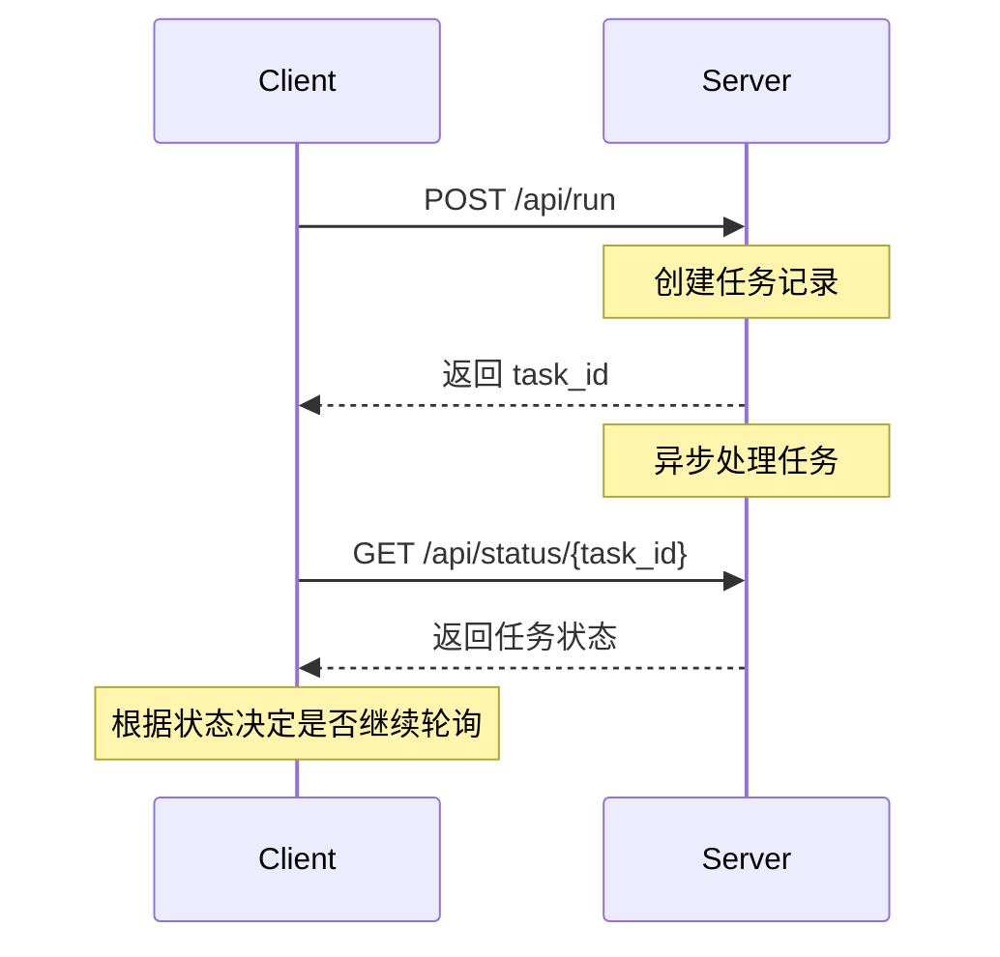
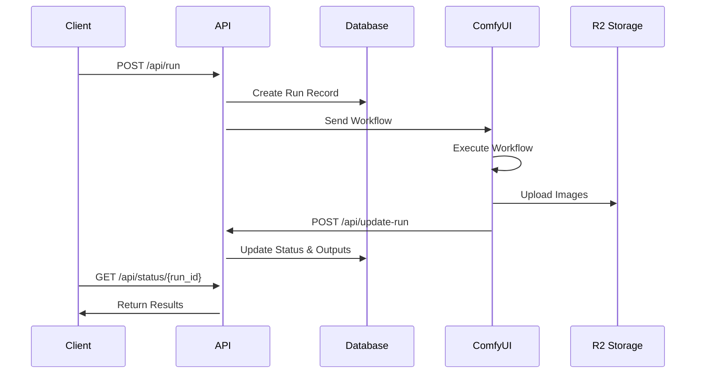
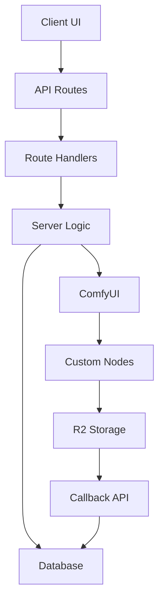
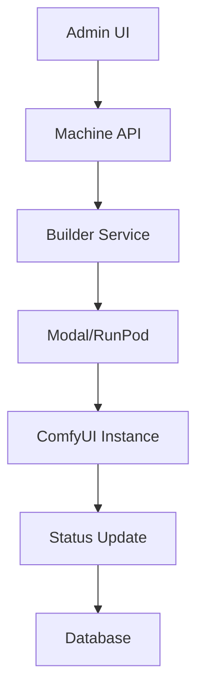

# ComfyUI Deploy

这是 fork 出来的，原项目是https://github.com/BennyKok/comfyui-deploy
会汉化！

# 重要更新记录

## 1. CORS 问题修复

### 问题描述

在使用 Figma 插件时，出现跨域请求被阻止的问题。

### 解决方案

1. 更新 `vercel.json` 配置：

```json
{
  "headers": [
    {
      "source": "/api/(.*)",
      "headers": [
        { "key": "Access-Control-Allow-Origin", "value": "*" },
        { "key": "Access-Control-Allow-Methods", "value": "GET, POST, OPTIONS" }
      ]
    }
  ]
}
```

2. 在 API 路由中添加 CORS 中间件：

```typescript
app.use("*", corsHandler);
```

## 2. Vercel 60s 超时问题

### 问题描述

Vercel 函数有 60 秒的超时限制，导致长时间运行的任务失败。

### 解决方案

实现异步任务处理机制：

1. 立即返回任务 ID
2. 后台异步处理请求
3. 客户端通过轮询获取结果

### API 调用流程



## 3. 图片 URL 格式问题

### 问题描述

图片 URL 格式不一致，导致访问失败：

```
# 错误格式（包含 bucket）
https://pub-xxx.r2.dev/comfyui-deploy/outputs/runs/{run_id}/image.png

# 正确格式
https://pub-xxx.r2.dev/outputs/runs/{run_id}/image.png
```

### 解决方案

修改 `update-run/route.ts` 中的 URL 构建逻辑：

```typescript
// 修改前
image.url = `${CDN_ENDPOINT}/${BUCKET}/outputs/runs/${run_id}/${image.filename}`;

// 修改后
image.url = `${CDN_ENDPOINT}/outputs/runs/${run_id}/${image.filename}`;
```

# 使用注意事项

1. 工作流发布务必删除所有预览节点，不然会报错
2. 默认值尽量不要加载过多的 base64 格式图像，不然会很慢
3. API 请求处理流程：
   - `/api/run` 接口会立即返回 task_id
   - 使用 `/api/status/{task_id}` 轮询任务状态
   - 任务状态包括：not-started, running, uploading, success, failed
4. 超时处理：
   - Vercel 函数有 60s 超时限制
   - 任务创建后会立即返回，避免超时
   - 使用状态轮询机制获取最终结果

# API 调用流程


localhost 方法不成功！

# ComfyUI Deploy

A deployment solution for ComfyUI workflows.

## Components

### Input Components

| Component Name                    | Type    | Input Parameters                                                       | Description             | Example Value                           |
| --------------------------------- | ------- | ---------------------------------------------------------------------- | ----------------------- | --------------------------------------- |
| ComfyUIDeployExternalText         | string  | input_id<br>display_name<br>description<br>default_value               | Text input field        | "hello world"                           |
| ComfyUIDeployExternalImage        | string  | input_id<br>display_name<br>description<br>default_value               | Image URL input         | "https://example.com/image.jpg"         |
| ComfyUIDeployExternalImageAlpha   | string  | input_id<br>display_name<br>description<br>default_value               | Alpha channel image URL | "https://example.com/alpha.png"         |
| ComfyUIDeployExternalNumber       | float   | input_id<br>display_name<br>description<br>default_value               | Float number input      | 0.5                                     |
| ComfyUIDeployExternalNumberInt    | integer | input_id<br>display_name<br>description<br>default_value               | Integer input           | 42                                      |
| ComfyUIDeployExternalNumberSlider | float   | input_id<br>display_name<br>description<br>default_value<br>min<br>max | Slider input            | 0.7                                     |
| ComfyUIDeployExternalLora         | string  | input_id<br>display_name<br>description<br>default_value               | Lora model URL          | "https://example.com/lora.safetensors"  |
| ComfyUIDeployExternalCheckpoint   | string  | input_id<br>display_name<br>description<br>default_value               | Checkpoint model URL    | "https://example.com/model.safetensors" |
| ComfyUIDeployExternalBoolean      | boolean | input_id<br>display_name<br>description<br>default_value               | Boolean switch          | true/false                              |

### How to Add New Components

1. Register component type in `web/src/components/customInputNodes.tsx`:

```typescript
export const customInputNodes: Record<string, string> = {
  ComfyUIDeployExternalNewType: "type description",
};
```

2. Add processing logic in `web/src/server/createRun.ts`:

```typescript
if (node.class_type == "ComfyUIDeployExternalNewType") {
  node.inputs["default_value"] = inputs[key];
}
```

3. Create Python node in `comfy-nodes/`:

```python
class ComfyUIDeployExternalNewType:
    def __init__(self):
        self.input_id = "input_id"
        self.display_name = "Display Name"
        self.description = "Description"
        self.default_value = "default"
```

### Component Development Guidelines

1. **Naming Convention**

- Must start with `ComfyUIDeploy`
- Use `External` for external inputs
- Use specific type as suffix

2. **Required Parameters**

- `input_id`: Unique identifier
- `display_name`: Display name
- `description`: Component description
- `default_value`: Default value

3. **Type Handling**

- String types: Direct pass
- Number types: Need conversion
- Boolean: Need standardization

```typescript
const boolValue = String(inputs[key]).toLowerCase() === "true";
```

4. **Error Handling**

- Validate input values
- Handle type conversions safely
- Provide meaningful error messages

## Important Notes

1. All components must be registered in `customInputNodes.tsx`
2. Ensure unique component names
3. Handle input value type conversions correctly
4. Add proper error handling
5. Update documentation and changelog

Open source comfyui deployment platform, a `vercel` for generative workflow infra. (serverless hosted gpu with vertical intergation with comfyui)

> [!NOTE]  
> Im looking for creative hacker to join ComfyDeploy's core team! DM me on [twitter](https://x.com/BennyKokMusic)

Join [Discord](https://discord.gg/EEYcQmdYZw) to chat more or visit [Comfy Deploy](https://comfydeploy.com/) to get started!

Check out our latest [nextjs starter kit](https://github.com/BennyKok/comfyui-deploy-next-example) with Comfy Deploy

\# How it works

1. Comfy Deploy Dashboard (https://comfydeploy.com) or self-hosted version
2. Machines (Long running, on-premise ComfyUI machines and serverless)
3. Supports runpods, modal, and hosted ComfyDeploy machines (powered by modal)

https://github.com/BennyKok/comfyui-deploy/assets/18395202/85f85325-a4bb-446d-aa67-ed225ee03479

# Setting up a basic sd txt2img API

https://github.com/BennyKok/comfyui-deploy/assets/18395202/0fb1829b-401a-41f2-b21a-5b77483c6ee2

# Comfy Deploy Plugin Installation

> Plugin lets you set up the machine as a target machine, and also upload workflow directly from there

1. `cd custom_nodes`
2. `git clone https://github.com/BennyKok/comfyui-deploy.git`
3. Go to (https://comfydeploy.com) or a self-hosted version
   - Machines -&gt; Add Machines
     - Enter a name and the URL of your machines (set up Ngrok for a public URL for your machines)
     - Create a new ComfyDeploy machines (pick any custom nodes).

# Usecase

1. Deploy a complicated comfy workflow with a versioning system
2. Manage versioning and easily preview different generated versions' output
3. Persistent API generated for Production and Staging environment
4. Run the same comfyui workflow across different remote machines

\# Status & Timeline

WIP, welcomes contributors!! Please join Discord -&gt; https://discord.gg/EEYcQmdYZw

Primary goal -&gt; release v0.1.0 of stable Comfy Deploy

Major areas

- Security enforcement
- Error handling
- QOL workflow improvement
- API usage examples
- Load balancing
- Workflow dependencies checking (custom nodes)
- Remote machines
- Serverless machines? Possible to set up a clean environment via Salad, Modal, etc
- LCM realtime web socket image gen

# Tech Stack

- Shadcn UI

- NextJS

- Clerk (Auth)

- Neon / Vercel Postgres (Database)

- Drizzle (ORM)

- R2 / S3 (Object Storage)

# Development

1. `git clone https://github.com/BennyKok/comfyui-deploy`
2. `cd web`
3. `bun i`
4. Start docker
5. `cp .env.example .env.local`
6. Replace `JWT_SECRET` with `openssl rand -hex 32`
7. Get a local clerk dev key for `NEXT_PUBLIC_CLERK_PUBLISHABLE_KEY` and `CLERK_SECRET_KEY`
8. Keep a terminal live for `bun run db-dev`
9. Execute the local migration to create the initial data `bun run migrate-local`
10. Finally start the next server with `bun dev`

**Schema Changes**

1. `bun run generate`
2. `bun run migrate-local`

# Special Thanks

- comfyui
- oss/acc

# Self Hosting with Vercel

[](https://www.youtube.com/watch?v=hWvsEY1cS2M)
Tutorial Created by [Ross](https://github.com/rossman22590) and [Syn](https://github.com/mortlsyn)

Build command

```
next build && bun run migrate-production
```

Install command

```
npx bun@1.0.16 install
```

Env key setup

```
POSTGRES_URL=

NEXT_PUBLIC_CLERK_PUBLISHABLE_KEY=
CLERK_SECRET_KEY=

SPACES_ENDPOINT="http://localhost:4566"
SPACES_ENDPOINT_CDN="http://localhost:4566"
SPACES_BUCKET="comfyui-deploy"
SPACES_KEY="xyz"
SPACES_SECRET="aaa"

# generate using -> openssl rand -hex 32
JWT_SECRET=

# r2 settings
SPACES_REGION="auto"
SPACES_CDN_FORCE_PATH_STYLE="true"
SPACES_CDN_DONT_INCLUDE_BUCKET="true"

# digital ocean settings
SPACES_REGION="nyc3"
SPACES_CDN_FORCE_PATH_STYLE="false"

# s3 settings
SPACES_REGION="nyc3"
SPACES_CDN_DONT_INCLUDE_BUCKET="false"
SPACES_CDN_FORCE_PATH_STYLE="true"
```

# ComfyUI Deploy API Documentation

## Architecture Overview

### Core Components

- **Web Server**: Next.js + Hono (API Routes)
- **Database**: PostgreSQL + Drizzle ORM
- **Storage**: Cloudflare R2
- **ComfyUI Integration**: Custom Python Server

### Directory Structure

```
web/
├── src/
│   ├── app/
│   │   └── (app)/api/         # API Routes
│   ├── routes/                # Hono Route Handlers
│   ├── server/                # Business Logic
│   └── db/                    # Database Schema & Queries
├── test/                      # API Tests
└── comfyui-deploy/           # ComfyUI Integration
```

## API Flow

### Workflow Execution Flow



### Status Lifecycle

```
not-started -> running -> uploading -> success
                      \-> failed
```

## API Endpoints

### Create Run

```typescript
POST /api/run
Content-Type: application/json
Authorization: Bearer <API_TOKEN>

{
  "deployment_id": "string",
  "inputs": {
    "text_input": "string"
  }
}

Response:
{
  "run_id": "uuid"
}
```

### Get Run Status

```typescript
GET /api/status/{run_id}
Authorization: Bearer <API_TOKEN>

Response:
{
  "id": "string",
  "status": "not-started" | "running" | "uploading" | "success" | "failed",
  "started_at": "datetime",
  "ended_at": "datetime",
  "duration": number,
  "outputs": [{
    "images": [{
      "url": "string",
      "type": "output",
      "filename": "string",
      "subfolder": "string",
      "upload_duration": number
    }],
    "created_at": "datetime"
  }],
  "error": "string",
  "progress": {
    "current": number,
    "total": number,
    "message": "string"
  }
}
```

### Update Run Status (Internal)

```typescript
POST /api/update-run
Content-Type: application/json

{
  "run_id": "string",
  "output_data": {
    "images": [{
      "filename": "string",
      "data": "base64"
    }]
  }
}
```

## Implementation Details

### Database Schema

```typescript
// Key Tables
workflowRunsTable {
  id: uuid
  workflow_version_id: uuid
  status: enum
  started_at: timestamp
  ended_at: timestamp
}

workflowRunOutputs {
  id: uuid
  run_id: uuid
  data: jsonb
}
```

### Image Processing Flow

1. ComfyUI generates images
2. Images uploaded to R2 Storage
3. URLs constructed: `${CDN_ENDPOINT}/outputs/runs/${run_id}/${filename}`
4. URLs stored in database with run outputs

### Environment Configuration

```env
SPACES_ENDPOINT="https://xxx.r2.cloudflarestorage.com"
SPACES_ENDPOINT_CDN="https://pub-xxx.r2.dev"
SPACES_BUCKET="comfyui-deploy"
SPACES_KEY="xxx"
SPACES_SECRET="xxx"
```

## Usage Example

```typescript
import axios from "axios";

const API_BASE = "http://localhost:3000/api";
const headers = {
  Authorization: `Bearer ${API_TOKEN}`,
  "Content-Type": "application/json",
};

// Create run
const runResponse = await axios.post(
  `${API_BASE}/run`,
  {
    deployment_id,
    inputs: { text_input: "test generation" },
  },
  { headers }
);

// Poll status
async function pollRunStatus(run_id: string) {
  while (true) {
    const { data } = await axios.get(`${API_BASE}/status/${run_id}`, {
      headers,
    });

    if (data.status === "success") {
      return data;
    }

    if (data.status === "failed") {
      throw new Error(data.error);
    }

    await new Promise((resolve) => setTimeout(resolve, 2000));
  }
}

const result = await pollRunStatus(runResponse.data.run_id);
console.log("Images:", result.images);
```

## Error Handling

- API returns appropriate HTTP status codes
- Failed runs include error details in status response
- Image upload failures still return valid CDN URLs

## Security

- API requires Bearer token authentication
- Tokens can be created and managed via API keys
- Rate limiting applied to public endpoints

## Project Architecture

### Core Structure

```
.
├── web/                       # Web Application
│   ├── src/
│   │   ├── app/              # Next.js App Router
│   │   │   ├── (app)/       # Main Application
│   │   │   │   ├── api/     # API Endpoints
│   │   │   │   ├── workflows/ # Workflow UI
│   │   │   │   └── machines/ # Machine Management
│   │   │   └── (docs)/      # Documentation
│   │   ├── components/       # React Components
│   │   ├── routes/          # API Route Handlers
│   │   ├── server/          # Business Logic
│   │   ├── db/              # Database Layer
│   │   ├── lib/             # Utilities
│   │   └── types/           # TypeScript Types
│   ├── public/              # Static Assets
│   ├── test/                # API Tests
│   └── drizzle/             # Database Migrations
├── comfy-nodes/             # ComfyUI Custom Nodes
├── builder/                 # Build System
└── web-plugin/             # ComfyUI Web Plugin
```

### Component Details

#### 1. Web Application (`web/`)

- **Frontend (`src/components/`)**

  - `ui/`: Base UI components (shadcn/ui)
  - `RunDisplay.tsx`: Execution status
  - `WorkflowList.tsx`: Workflow management
  - `MachineList.tsx`: Machine management
  - `custom-form/`: Custom form components
  - `docs/`: Documentation components

- **API Layer (`src/app/(app)/api/`)**

  - `update-run/`: ComfyUI callback handling
  - `file-upload/`: Image upload processing
  - `machine-built/`: Machine build status
  - `view/`: Image serving

- **Route Handlers (`src/routes/`)**

  - `registerGetStatusRoute.ts`: Status polling
  - `registerCreateRunRoute.ts`: Run creation
  - `registerDeploymentsRoute.ts`: Deployment management
  - `registerUploadRoute.ts`: File uploads

- **Server Logic (`src/server/`)**

  - `createRun.ts`: Workflow execution
  - `curdApiKeys.ts`: API key management
  - `curdMachine.ts`: Machine management
  - `getFileDownloadUrl.ts`: Storage URLs
  - `editWorkflowOnMachine.tsx`: Workflow editing

- **Database (`src/db/`)**
  - `schema.ts`: Data models
  - `db.ts`: Database connection
  - Migration files in `drizzle/`

#### 2. ComfyUI Integration (`comfy-nodes/`)

- Custom node implementations:
  - Input nodes (text, image, number, etc.)
  - Output nodes (image, websocket)
  - Model handling nodes
  - External resource nodes

#### 3. Build System (`builder/`)

- `modal-builder/`: Modal.com serverless builder
  - Dockerfile configuration
  - Build requirements
  - Template system

#### 4. Web Plugin (`web-plugin/`)

- ComfyUI web interface integration

### Data Flow Architecture

1. **Workflow Creation & Execution**



2. **Machine Management**



### Key Features

1. **Workflow Management**

- Version control
- Custom node support
- Real-time status updates
- Input validation

2. **Machine Management**

- Multiple provider support
  - Modal.com
  - RunPod
  - Custom servers
- Auto-scaling
- Health monitoring

3. **Storage System**

- Cloudflare R2 integration
- CDN delivery
- Image processing
- Version management

4. **Security**

- JWT authentication
- API key management
- Role-based access
- Request validation

### Development Tools

- `drizzle/`: SQL migrations
- `test/`: API testing
- `aws/`: Cloud configuration
- Development containers

## Development Setup

### Storage Configuration

#### Production (Cloudflare R2)

```env
SPACES_ENDPOINT="https://xxx.r2.cloudflarestorage.com"
SPACES_ENDPOINT_CDN="https://pub-xxx.r2.dev"
SPACES_BUCKET="comfyui-deploy"
SPACES_KEY="your-key"
SPACES_SECRET="your-secret"
SPACES_CDN_DONT_INCLUDE_BUCKET="false"
SPACES_CDN_FORCE_PATH_STYLE="false"
```

#### Local Development (LocalStack)

```env
SPACES_ENDPOINT="http://172.26.61.86:4566"
SPACES_ENDPOINT_CDN="http://172.26.61.86:4566"
SPACES_BUCKET="comfyui-deploy"
SPACES_KEY="test"
SPACES_SECRET="test"
SPACES_REGION="us-east-1"
SPACES_CDN_DONT_INCLUDE_BUCKET="false"
SPACES_CDN_FORCE_PATH_STYLE="true"
```

> Note: When running ComfyUI on Windows with LocalStack in WSL2, use the WSL2 IP address instead of localhost.

### Image Processing Flow

1. ComfyUI generates images
2. Images uploaded to storage (R2 or LocalStack)
3. URLs constructed: `${CDN_ENDPOINT}/${BUCKET}/outputs/runs/${run_id}/${filename}`
4. URLs stored in database with run outputs

# comfyui 到前端、api 的参数传递

好的，下面是将修复 `ComfyUIDeployExternalNumberSlider` 参数的过程记录写入 `README.md` 文档的内容。请查看以下内容并确认是否需要进一步修改。

### 更新 `README.md`

``````markdown
# ComfyUI Deploy Documentation

## 参数定义和传递

### ComfyUIDeployExternalNumberSlider

- **类型**: float
- **描述**: 滑块输入，允许用户选择一个数值。
- **默认值**: 0
- **范围**: 0 - 100

#### 前端实现示例

```jsx
<input
  type="range"
  min="0"
  max="100"
  defaultValue="0"
  onChange={(e) =>
    setValues({ ...values, ComfyUIDeployExternalNumberSlider: e.target.value })
  }
/>
```

``````

`````markdown
#### API 处理示例

在 `createRun` 函数中处理滑块参数：

```typescript
if (inputs && inputs.ComfyUIDeployExternalNumberSlider !== undefined) {
  const sliderValue = inputs.ComfyUIDeployExternalNumberSlider; // 获取滑块的值
  console.log("Slider value:", sliderValue); // 处理逻辑，例如存储或传递给其他函数
}
``````

## 修复过程记录

### 1. 问题描述

在项目中，`ComfyUIDeployExternalNumberSlider` 参数未能正确暴露，导致前端和 API 无法识别和处理该参数。我们需要确保该参数能够在前端和 API 中正确传递，并且能够包含其细节，如数值范围和默认值。

### 2. 改动范围

- **文件**: `web/src/components/customInputNodes.tsx`
  - **修改**: 添加 `ComfyUIDeployExternalNumberSlider` 的定义，指定其类型和描述。
- **文件**: `web/src/server/createRun.ts`

  - **修改**: 在 `createRun` 函数中处理 `ComfyUIDeployExternalNumberSlider` 参数，确保其值能够被正确获取和使用。

- **文件**: `web/src/routes/registerCreateRunRoute.ts`

  - **修改**: 确保在创建运行时，`inputs` 包含 `ComfyUIDeployExternalNumberSlider` 参数。

- **文件**: `web/src/components/RunWorkflowInline.tsx`

  - **修改**: 在提交表单时，确保滑块的值能够被正确传递。

- **文件**: `web/src/app/(app)/api/update-run/route.ts`
  - **修改**: 在更新运行状态时，确保能够处理 `ComfyUIDeployExternalNumberSlider` 参数。

### 3. 代理链路

- **前端**:

  - 用户在 UI 中通过滑块输入值。
  - `RunWorkflowInline` 组件将滑块的值存储在 `values` 状态中，并在提交时将其传递给 `createRun` 函数。

- **API**:
  - `registerCreateRunRoute` 接收请求，提取 `inputs` 中的 `ComfyUIDeployExternalNumberSlider` 参数。
  - `createRun` 函数处理该参数，并在需要时使用其值。

### 4. 参数细节的传递

为了将 `ComfyUIDeployExternalNumberSlider` 的细节（如数值范围和默认值）传递到前端或 API，我们可以采取以下步骤：

- **在 `customInputNodes.tsx` 中定义参数细节**:

  ```typescript
  ComfyUIDeployExternalNumberSlider: "float - (slider input with min and max values, default: 0, range: 0-100)",
  ```

- **在前端 UI 中**:

  - 在滑块组件中，使用 `min`、`max` 和 `defaultValue` 属性来定义滑块的行为。

- **在 API 中**:
  - 在处理请求时，确保能够接收和使用这些参数细节。

### 5. 后续建议

- **文档更新**: 在 `README.md` 中添加关于新参数的详细说明，包括其定义、使用示例和注意事项。
- **参数扩展**: 为其他参数定义类似的细节，以便在前端和 API 中能够一致地处理。

```

# 重要更新：修复图片 URL 问题

## 问题描述
在使用 API 时，图片 URL 的格式不一致，导致某些情况下图片无法正常访问：

1. 有时 URL 包含 bucket 名称：
```

https://pub-xxx.r2.dev/comfyui-deploy/outputs/runs/{run_id}/image.png

```

2. 有时不包含 bucket 名称（正确格式）：
```

https://pub-xxx.r2.dev/outputs/runs/{run_id}/image.png

````

## 问题原因
1. 在 `/api/update-run` 接口中，URL 构建逻辑错误地包含了 bucket 名称
2. 环境变量 `SPACES_CDN_DONT_INCLUDE_BUCKET="false"` 的设置影响了 URL 的构建

## 解决方案
修改 `web/src/app/(app)/api/update-run/route.ts` 中的 URL 构建逻辑：
```typescript
// 修改前
image.url = `${CDN_ENDPOINT}/${BUCKET}/outputs/runs/${run_id}/${image.filename}`;

// 修改后
image.url = `${CDN_ENDPOINT}/outputs/runs/${run_id}/${image.filename}`;
```

## 技术细节

1. URL 构建发生在 ComfyUI 生成图片后调用 `/api/update-run` 时
2. 构建的 URL 被保存在数据库中
3. 前端和 API 直接使用数据库中存储的 URL
4. 不需要修改其他组件，因为 URL 在源头就被正确构建

## 验证方法

1. 使用 API 生成新图片
2. 检查返回的图片 URL 格式
3. 验证图片是否可以正常访问

## 注意事项

1. 确保环境变量设置正确
2. 新生成的图片 URL 将自动使用正确格式
3. 历史数据中的 URL 可能需要单独处理

## 相关文件

- `web/src/app/(app)/api/update-run/route.ts`
- `web/src/routes/registerGetStatusRoute.ts`
- `web/src/server/createRun.ts`
```

# 图片处理功能说明

## 工作流程

1. 图片上传流程
   - 接收前端传入的 base64 格式图片
   - 自动转换并上传到 R2 存储
   - 生成可访问的 CDN URL
   - 更新工作流中的图片节点参数

2. 参数传递机制
   ```typescript
   // 示例：图片节点处理
   if (node.class_type === "ComfyUIDeployExternalImage") {
     const value = inputs[key];
     if (typeof value === 'string' && value.startsWith('data:image')) {
       // 上传到 R2 并更新节点参数
       node.inputs["input_id"] = url;
     }
   }
   ```

3. 执行顺序
   - 先处理所有图片上传
   - 等待上传完成
   - 更新工作流参数
   - 发送到 ComfyUI 执行

## 注意事项

1. 图片处理
   - 支持 base64 格式的图片输入
   - 自动处理图片上传和转换
   - 确保上传完成后再执行工作流

2. 参数设置
   - 图片节点使用 input_id 参数传递 URL
   - 保持与原有参数传递逻辑一致
   - 支持动态的 input_id 命名

3. 环境配置
   需要配置以下环境变量：
   ```env
   SPACES_ENDPOINT=your_r2_endpoint
   SPACES_ENDPOINT_CDN=your_cdn_endpoint
   SPACES_BUCKET=your_bucket_name
   SPACES_KEY=your_access_key
   SPACES_SECRET=your_secret_key
   ```

## 技术实现

1. 图片上传
   - 使用 S3 兼容的 API 上传到 R2
   - 生成唯一文件名避免冲突
   - 设置正确的 Content-Type 和 ACL

2. 异步处理
   - 使用 Promise.all 等待所有上传完成
   - 确保按正确顺序执行操作
   - 完整的错误处理和状态更新

3. 日志追踪
   - 记录上传过程和状态
   - 跟踪参数传递
   - 便于调试和监控
````
``````
